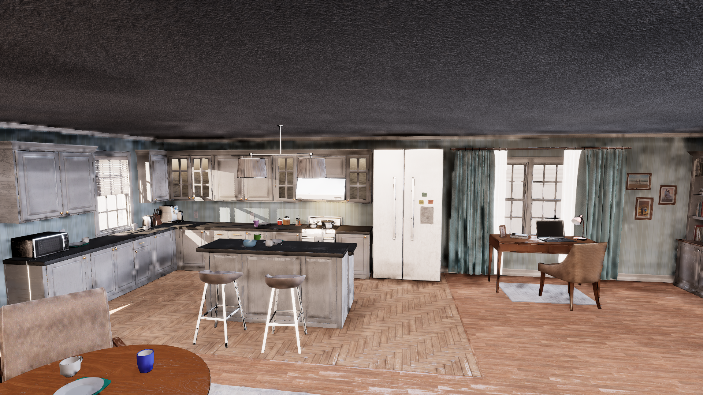
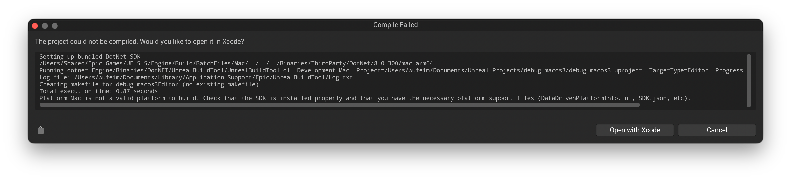
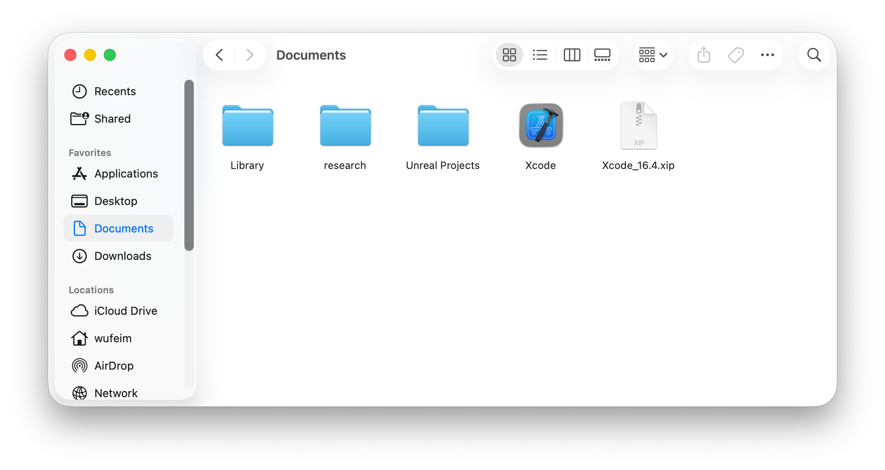
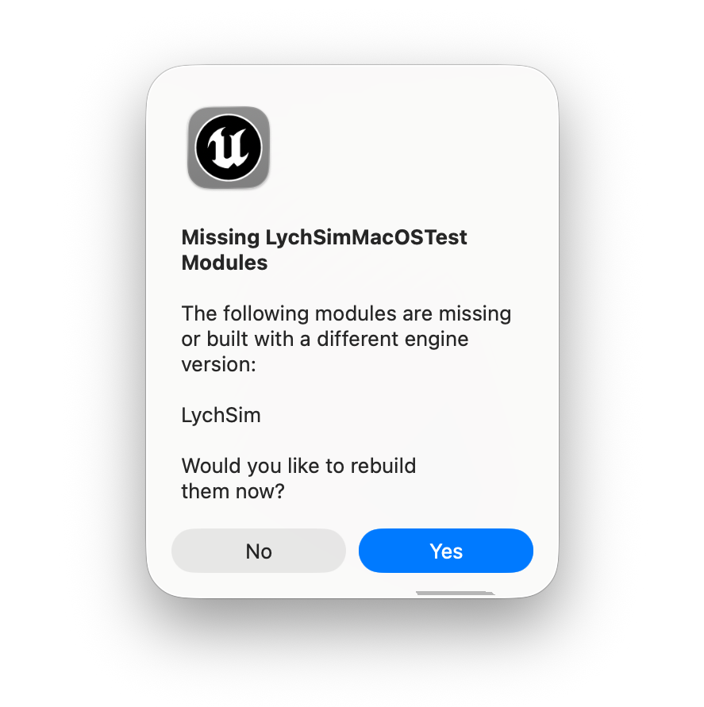
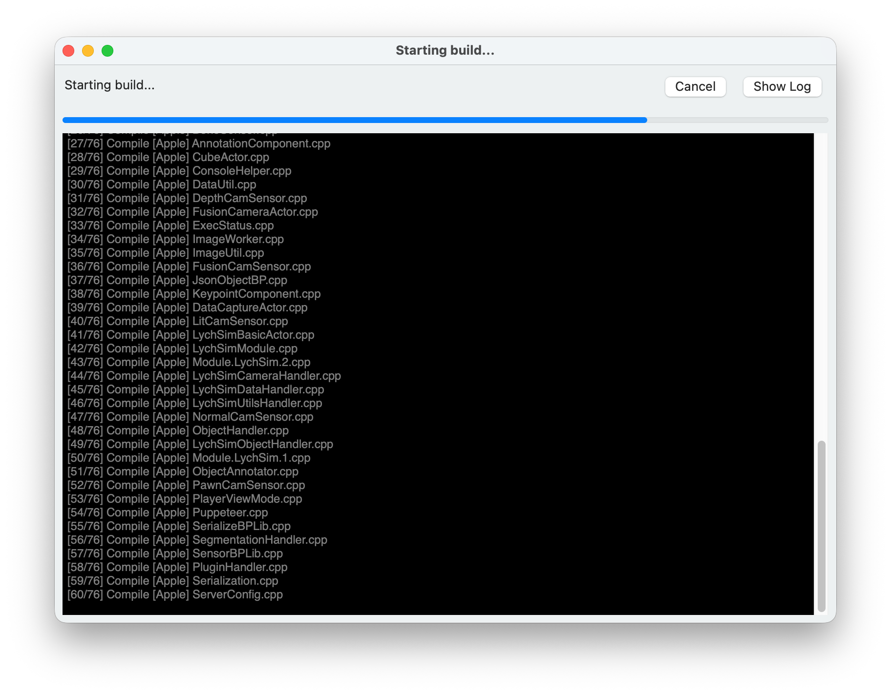
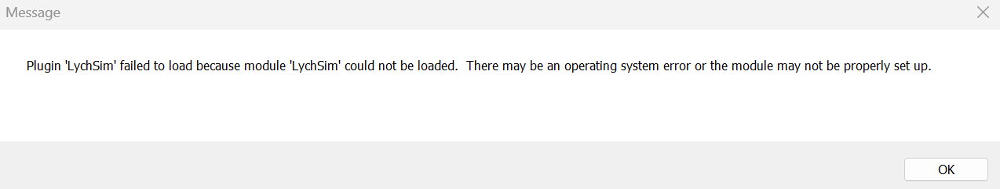
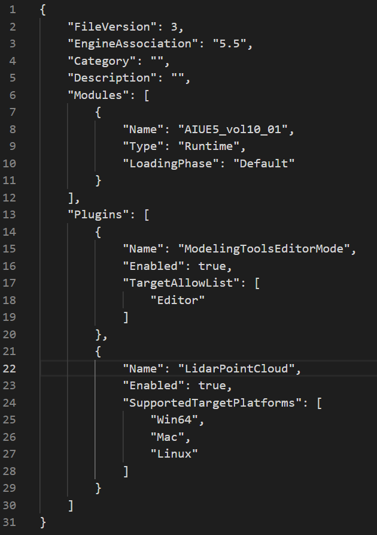

Troubleshooting
===============

1. Artifacts and low-quality rendering with Lumen
-------------------------------------------------

Current :code:`LychSim` implementation may not fully support Lumen features and may exhibit artifacts or lower quality rendering compared to native Lumen.

**Fix.** This should be fixed now. Please submit an issue if the problem persists.

   Artifacts and low-quality rendering with Lumen.

2. Cannot connect to UE5
------------------------

This issue may arise when the default port, *i.e.*, 9000, is blocked or in use by another process. This is often caused by previously uncleaned instances of the server or other applications occupying the same port.

**Fix.** Run :code:`netstat -ano | findstr :9000` to check for unwanted processes. Then kill these processes using :code:`taskkill /PID <pid> /F`.

3. Platform Mac is not a valid platform to build
------------------------------------------------

This issue may arise when using an un-supported Xcode version.

   Platform Mac is not a valid platform to build.

**Fix.** First download a supported Xcode version, e.g., `16.4`, from `xcodereleases.com <https://xcodereleases.com/>`_. Unzip the Xcode and you will see the following.

   Downloaded Xcode 16.4.

Then use `xcode-select` to ensure 16.4 is the default command-line build tool.

.. code-block:: bash

   sudo xcode-select -s /Users/wufeim/Documents/Xcode.app/Contents/Developer

   # optionally, verify the selected version
   xcode-select -p

Link the plugin code following the `installation instructions <https://wufeim.github.io/LychSim/tutorials/installation.html#install-and-compile-lychsim-plugin>`_. Open the project and you will see the prompt to compile the `LychSim` plugin. Everything should work now.

   Prompt to compile the LychSim plugin.

   LychSim plugin compiling...

4. Cannot package project for Linux: Issue with UbaSessionServer
----------------------------------------------------------------

This issue may arise when packaging a project for Linux target platform. The log may show an error related to `UbaSessionServer`, *e.g.*, an unhandled exception as shown below.

.. code-block::

   UATHelper: Packaging (Linux): UbaSessionServer - ASSERT: Unhandled Exception (Code: 0xc0000005)
   UATHelper: Packaging (Linux): Callstack:
   UATHelper: Packaging (Linux): ntdll.dll: +0x12d26
   UATHelper: Packaging (Linux): ntdll.dll: +0x120f6
   UATHelper: Packaging (Linux): ntdll.dll: +0x165c6e
   UATHelper: Packaging (Linux): UbaDetours.dll: +0x492e
   UATHelper: Packaging (Linux): ucrtbase.dll: +0x3d189
   UATHelper: Packaging (Linux): ucrtbase.dll: +0x14a0c
   UATHelper: Packaging (Linux): ucrtbase.dll: +0x1488b
   UATHelper: Packaging (Linux): ucrtbase.dll: +0x14844
   UATHelper: Packaging (Linux): ucrtbase.dll: +0x14e01
   UATHelper: Packaging (Linux): combase.dll: +0x183fcd
   UATHelper: Packaging (Linux): combase.dll: +0x183fed
   UATHelper: Packaging (Linux): combase.dll: +0x39cbc
   UATHelper: Packaging (Linux): combase.dll: +0x39306

The cause of this issue is to package project for Linux using some latest Windows updates, *e.g.*, :code:`KB5060842`, as discussed in `this forum thred <https://forums.unrealengine.com/t/ubasessionserver-assert-by-cross-compile-toolchain-imd-ue5-5/2615317>`_.

One workaround is to disable **Unreal Build Automation (UBA)** before packaging. Following `this forum thread <https://dev.epicgames.com/community/learning/tutorials/9dv9/unreal-engine-disable-ubasessionserver-uba>`_, you can disable UBA by editing the :code:`BuildConfiguration.xml` file located at :code:`C:\\Users\\username\\AppData\\Roaming\\Unreal Engine\\UnrealBuildTool\\BuildConfiguration.xml`. Update the configuration so both :code:`bAllowUBAExecutor` and :code:`bAllowUBALocalExecutor` are set to :code:`false`, as shown below.

.. code-block:: xml

   <?xml version="1.0" encoding="utf-8" ?>
   <Configuration xmlns="https://www.unrealengine.com/BuildConfiguration">
     <BuildConfiguration>
       <bAllowUBAExecutor>false</bAllowUBAExecutor>
       <bAllowUBALocalExecutor>false</bAllowUBALocalExecutor>
     </BuildConfiguration>
   </Configuration>

5. Plugin 'LychSim' failed to load because module 'LychSim' could not be loaded.
--------------------------------------------------------------------------------

   Error when opening projects.

**Fix.** Open the :code:`.uproject` file with a text editor. Add the following lines to the :code:`Plugins` section.

.. code-block::

   {
		"Name": "LidarPointCloud",
		"Enabled": true,
		"SupportedTargetPlatforms": [
			"Win64",
			"Mac",
			"Linux"
		]
	}

An example of the :code:`Plugins` section is shown below.

   Example of the Plugins section in .uproject file.
