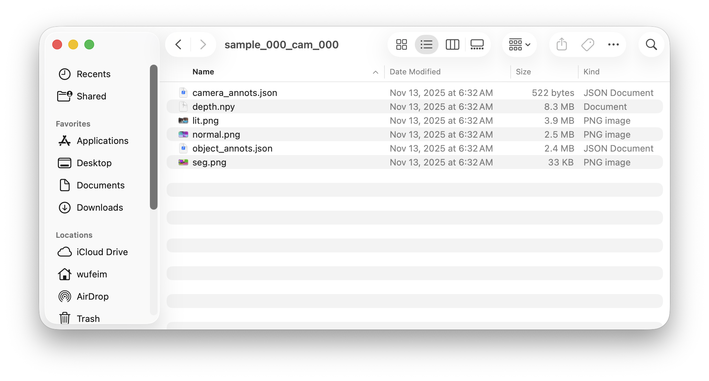
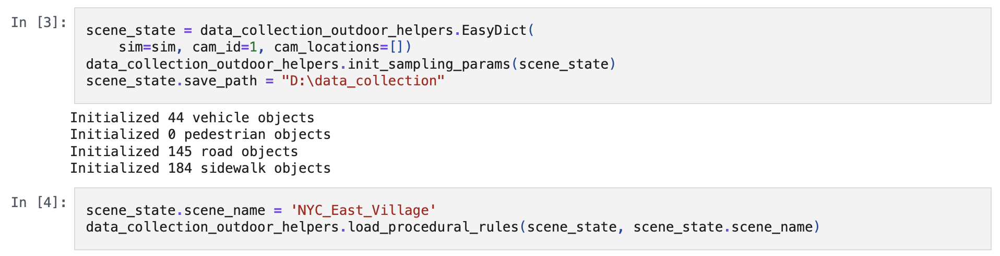

Using LychSim Datasets
======================

This documentation applies to LychSim datasets as of November 2025.

Overview
--------

LychSim data collection typically proceeds in three stages. First, we randomly sample a set of objects along with their initial placements. Next, we enable Unreal Engine (UE) physics simulation and wait until all objects reach a stable configuration. Finally, we select a camera viewpoint (or trajectory) and collect the data.

Data are saved in directories named using the format :code:`sample_000_cam_000`, where sample ID corresponds to a scene with randomly placed objects, and camera ID identifies a specific camera location or trajectory.

As illustrated below, each directory contains six files. In addition to RGB (lit), segmentation, depth, and normal renderings, :code:`object_annots.json` stores annotations describing the environment, objects, and sampling parameters, while :code:`camera_annots.json` records important information about the camera parameters.

   File layouts.

Camera Annotations
------------------

We can load camera extrinsic and intrinsic parameters from :code:`camera_annots.json`.

.. code:: python

   >>> import json
   >>> annots = json.load(open("camera_annots.json"))
   >>> annots.keys()
   dict_keys(['status', 'outputs'])
   >>> annots["status"]
   'ok'
   >>> annots["outputs"].keys()
   dict_keys(['location', 'rotation', 'fov', 'c2w', 'width', 'height', 'fxfycxcy'])
   >>> annots["outputs"]["location"]
   [-1183.3726806640625, 6058.03076171875, 374.64801025390625]
   >>> annots["outputs"]["rotation"]
   [-5.717591762542727, 27.658029556274425, 0]
   >>> annots["outputs"]["fxfycxcy"]
   [960.0000000000001, 960.0000000000002, 960.0, 540.0]

Object Annotations
------------------

We can load scene and object annotations from :code:`object_annots.json`.

.. code:: python

   >>> import json
   >>> annots = json.load(open('object_annots.json'))
   >>> annots.keys()
   dict_keys(['status', 'outputs', 'sampling', 'scene_state', 'lighting', 'fog'])
   >>> annots["status"]
   'ok'

We save the object sampling parameters used for placing the objects. (See `this code <https://github.com/wufeim/LychSim/blob/main/notebooks/data_collection_outdoor_helpers.py#L372>`_.) Here :code:`annots["sampling"]` is a list of dictionaries, each containing location, rotation, mesh path, etc. The locations are the initial object positions before the physics simulation.

   >>> annots["sampling"][0]
   {'loc': [-874.3808910999799, 6505.062123544488, -20.556038], 'rot': [0, -9.56143919756771, 0], 'obj_path': '/Game/Vehicles/VOL12_EmergencyResponse/Meshes/SM_Pd_Van_01a.SM_Pd_Van_01a', 'extent': [323.2451171875001, 131.63250732421886, 144.87890625], 'object_id': 'SM_Pd_Van_01a_c30f9f00'}

Scene state is also saved in :code:`annots["scene_state"]`, corresponding to the scene state information used when collecting data. (See `this notebook <https://github.com/wufeim/LychSim/blob/main/notebooks/lychsim_data_collection_outdoor.ipynb>`_.)

   Scene state usage.

Key lighting parameters, such as rotation and temperature of the directional light is saved in :code:`annots["lighting"]`.

.. code:: python

   >>> annots["lighting"]
   {'rotation': [-68.39920043945308, 128.7829742494278, -126.29943847656249], 'temperature': 6344}

If fog is simulated, we also record the fog density in :code:`annots["fog"]`.

.. code:: python

   >>> annots["fog"]
   {'density': 0.002}

We save all object annotations in :code:`annots["outputs"]`. The field :code:`sampled_by_us` implies if an object is sampled by us, *e.g.*, objects already in the scene file or ones we added to the scene. For objects not sampled by us, we store standard annotations as follows

.. code:: python

   >>> annots['outputs'][0].keys()
   dict_keys(['object_id', 'status', 'guid', 'aabb', 'obb', 'bounds', 'bounds_tight', 'location', 'rotation', 'scale', 'color', 'asset_path', 'sampled_by_us'])

For objects sampled by us, we store extra sampling parameters, same as ones stored in :code:`annots["sampling"]`. (See `this code <https://github.com/wufeim/LychSim/blob/main/notebooks/data_collection_outdoor_helpers.py#L515>`_.)

Example Usage
-------------

We first load camera parameters for 3D to 2D projection.

.. code::

   cam = json.load(open(os.path.join(data_path, seq, "camera_annots.json")))["outputs"]

We also load object annotations and :code:`scene_state` that records dimensions of the objects.

.. code::

   annots = json.load(open(os.path.join(data_path, seq, "object_annots.json")))["outputs"]
   scene_state = json.load(open(os.path.join(data_path, seq, "object_annots.json")))["scene_state"]

Now we visualize the target objects.

.. code::

   def convert(obj, scene_state):
       asset_path = obj["sampling_info"]["obj_path"]
       return dict(
           obj_id=obj["object_id"],
           extents=scene_state["mesh_extents"][asset_path],
           location=obj["location"],
           rotation=obj["rotation"],
           yaw_bias=sampling_params[asset_path]["rotation yaw"],
           loc_z_bias=sampling_params[asset_path]["location z"],
           mesh_2d_offset=[sampling_params[asset_path]["mesh_2d_offset_x"], sampling_params[asset_path]["mesh_2d_offset_y"]]
       )

   def draw(img, cam, obj):
       yaw_bias = - obj["yaw_bias"] / 180 * math.pi
       ex, ey, ez = obj["extents"]
       loc = obj["location"]
       rot = obj["rotation"]  # ry, rz, rx = pitch, yaw, roll
       ox, oy = obj["mesh_2d_offset"]

       corners_local_chassis = np.array([
           [ox-ex, oy-ey], [ox+ex, oy-ey],
           [ox+ex, oy+ey], [ox-ex, oy+ey]])
       R = np.array([
           [math.cos(yaw_bias), -math.sin(yaw_bias)],
           [math.sin(yaw_bias), math.cos(yaw_bias)],
       ])
       corners_local_chassis = np.dot(R, corners_local_chassis.T).T

       corners_local = np.concatenate(
           [corners_local_chassis, corners_local_chassis], axis=0)
       corners_local = np.concatenate(
           [corners_local, np.array([[0.0, 0.0, 0.0, 0.0, 2*ez, 2*ez, 2*ez, 2*ez]]).T], axis=1)

       pitch = -rot[0] / 180 * math.pi
       yaw = rot[1] / 180 * math.pi
       roll = -rot[2] / 180 * math.pi

       loc[2] += obj["loc_z_bias"]

       corners3d = get_corners_3d(loc, corners_local, yaw, pitch, roll)
       corners2d, _ = project(corners3d, np.array(cam["c2w"]).T, cam["fxfycxcy"])

       Ls = [
           np.linalg.norm(corners3d[0:1] - corners3d[1:2]),
           np.linalg.norm(corners3d[1:2] - corners3d[2:3]),
           np.linalg.norm(corners3d[0:1] - corners3d[4:5])]
       L = min(Ls)

       center3d = np.mean(corners3d, axis=0, keepdims=True)
       other_points_3d = [
           center3d + 0.5 * (corners3d[0:1] - corners3d[1:2]),
           center3d - 0.5 * (corners3d[0:1] - corners3d[1:2]),
           center3d + 0.5 * (corners3d[1:2] - corners3d[2:3]),
           center3d - 0.5 * (corners3d[1:2] - corners3d[2:3]),
           center3d + 0.5 * (corners3d[0:1] - corners3d[4:5]),
           center3d - 0.5 * (corners3d[0:1] - corners3d[4:5]),
           enter3d,
           center3d + 0.5 * (corners3d[0:1] - corners3d[1:2]) / np.linalg.norm(corners3d[0:1] - corners3d[1:2]) * L,
           center3d - 0.5 * (corners3d[1:2] - corners3d[2:3]) / np.linalg.norm(corners3d[1:2] - corners3d[2:3]) * L,
           center3d - 0.5 * (corners3d[0:1] - corners3d[4:5]) / np.linalg.norm(corners3d[0:1] - corners3d[4:5]) * L,
       ]
       other_points_3d = np.concatenate(other_points_3d, axis=0)
       other_points_2d, _ = project(other_points_3d, np.array(cam["c2w"]).T, cam["fxfycxcy"])
       other_points_2d = other_points_2d[6:]

       cam_loc = np.array(cam["c2w"]).T[:3, 3:].T
       dist = np.linalg.norm(other_points_3d[:6] - cam_loc, axis=1)

       dist = sorted([(dist[i], i) for i in range(6)])
       face_indices = [x[1] for x in dist[3:]]
       faces = []
       if 0 in face_indices:
           faces.append([1, 2, 6, 5])
       if 1 in face_indices:
           faces.append([0, 3, 7, 4])
       if 2 in face_indices:
           faces.append([2, 3, 7, 6])
       if 3 in face_indices:
           faces.append([0, 1, 5, 4])
       if 4 in face_indices:
           faces.append([4, 5, 6, 7])
       if 5 in face_indices:
           faces.append([0, 1, 2, 3])
       edges = []
       for f in faces:
           for i in range(4):
                edges.append((f[i], f[(i+1)%4]))

       if obj['cate'] not in color_mapping:
           raise ValueError(obj['cate'])
       else:
           color = color_mapping[obj['cate']]

       img = visualize_bbox(img.copy(), corners2d, edges, color=color, a=192, thickness=5)
       for f in faces:
           pts = np.concatenate([
               corners2d[f[i]:f[i]+1]
               for i in range(4)
           ])
           draw_transparent_poly(img, pts, alpha=0.5, color=color)

       for i, j, c in [(0, 1, (255, 0, 0, 192)), (0, 2, (0, 255, 0, 192)), (0, 3, (0, 0, 255, 192))]:
           pt1 = (int(other_points_2d[i, 0]), int(other_points_2d[i, 1]))
           pt2 = (int(other_points_2d[j, 0]), int(other_points_2d[j, 1]))
           cv2.line(img, pt1, pt2, c, 5)

       return img

   annots_vis = []
   for obj in annots:
       area = np.sum(np.all(seg == obj["color"], axis=-1))
       if area >= vis_threshold:
           annots_vis.append(obj)

   for i, obj in enumerate(annots_vis):
       obj = convert(obj, scene_state)
       vis_img = draw(obj, cam, scene_state, np.array(img))
       Image.fromarray(vis_img).save(f"debug_pose_{i:02d}.png")
