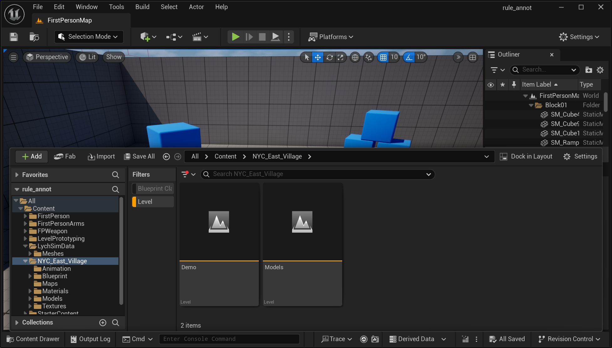
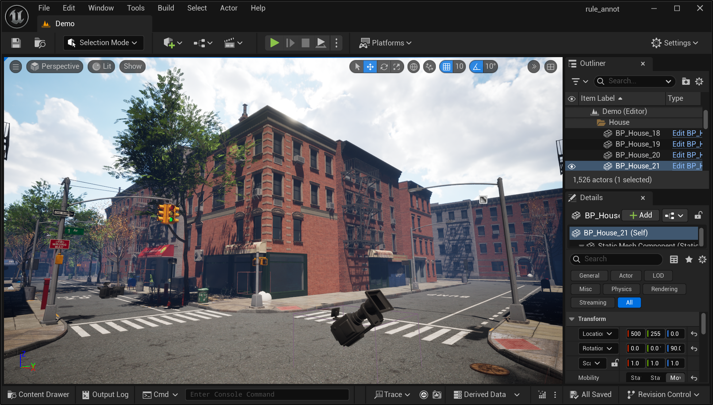
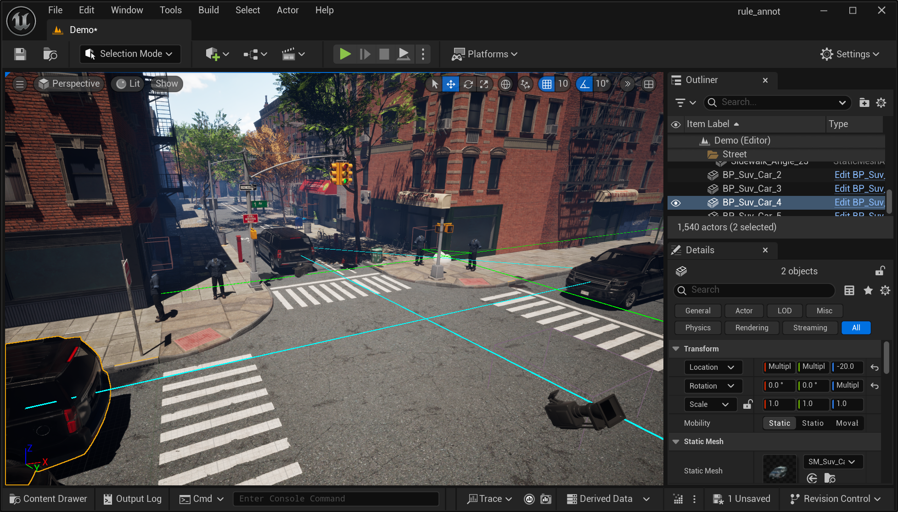
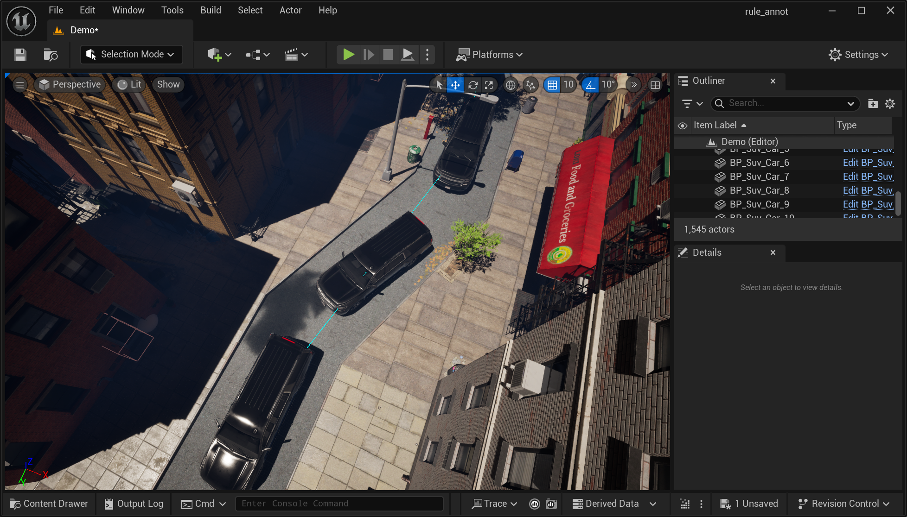
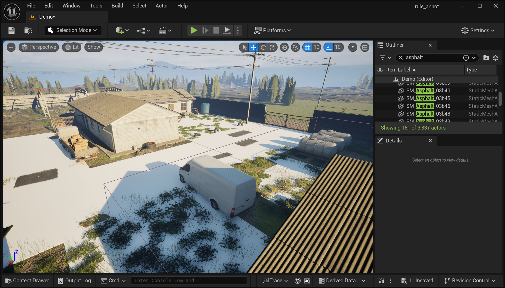
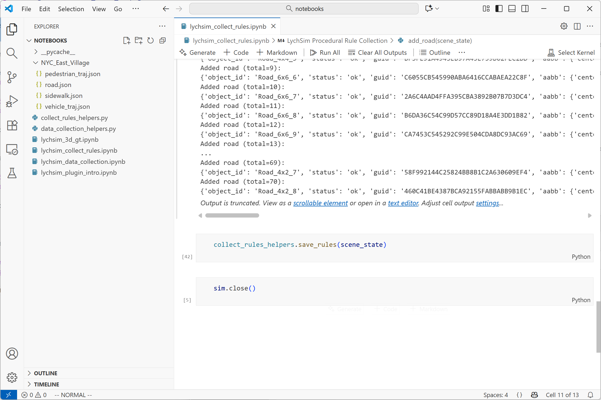

Annotating Procedural Rules
===========================

Set Up Environment
------------------

1. **UE project with LychSim.** Follow `the instructions <https://wufeim.github.io/LychSim/tutorials/installation.html>`_ to set up an UE project with LychSim plugin.

2. **Import the 3D scene.** Download one of the :code:`zip` files containing the 3D scene. Put the folder under the :code:`Content` folder of your UE project.

   Make sure the scene files are directly under the scene folder, *e.g.*, :code:`Content\\NYC_East_Village`, not another subfolder like :code:`Content\\NYC_East_Village\\NYC_East_Village`.

3. **Import LychSimData assets.** Download and unzip the :code:`LychSimData.zip` file into the :code:`Content` folder of your UE project.

4. **Sanity check.** By this point, you should have the following folder structure if you are using the :code:`NYC_East_Village` scene:

   .. code-block:: text

      your_ue_project
      ├── Content
      │   ├── LychSimData
      │       └── Meshes
      │   └── NYC_East_Village
      │       ├── Animation
      │       ├── Blueprint
      │       └── ... (other scene files)
      ├── your_ue_project.sln
      ├── your_ue_project.uproject
      └── ... (other project files)

5. **Open the procedural rule notebook.** Open the `procedural rule notebook <https://github.com/wufeim/LychSim/blob/main/notebooks/lychsim_collect_rules.ipynb>`_. For the following we will annotate procedural rules by running commands in this notebook.

   .. figure:: figures/annotate_rules_03.png
      :align: center

      Open the annotation notebook.

   Also make sure to change the name of the scene so your annotations are saved to the correct folder.

   .. figure:: figures/annotate_rules_04.png
      :align: center

      Change the scene name in the notebook.

Goal of This Tutorial
---------------------

Once you open the project, open the map level by opening the :code:`Content Drawer` on bottom left of the UE editor and navigating to the scene folder. Enable the filter for :code:`Level` to show only level files. Often there will be multiple level files for each scene, some of them for testing purposes, *e.g.*, showcasing all assets in the scene, and others for actual simulation with proper lighting and world layout. If there are multiple world level files, we only care about the main level file with daylight lighting.

   Open the content drawer and select the level file.

As you can see, most of the scenes are empty with very few pedestrians or vehicles. The goal of this tutorial is to annotate procedural rules to enable more realistic simulation of pedestrians and vehicles in the scene.

   An example scene.

We will annotate four types of procedural rules in this tutorial:

1. **Pedestrians walk directions.** Theses are represented by **undirected splines** in the scene. For instance, most pedestrians in a city scene would walk **along** the streets, not in random directions.
2. **Vehicles drive directions.** These are represented by **directed splines** in the scene. For instance, vehicles would drive **along** the roads, and follow traffic rules such as one-way streets.
3. **Sidewalk areas.** These are represented by **areas** in the scene. We can spawn any types of objects, such as pedestrians, trash cans, benches, within these areas.
4. **Road areas.** These are also represented by **areas** in the scene. We only spawn vehicles within these areas.

Annotate Pedestrian Walk Directions
-----------------------------------

1. **Place pedestrian actors.** Locate the human mesh in the :code:`Content\\LychSimData\\Meshes` folder. Drag and drop a few instances of the human mesh into the scene. Place them at keyframes where pedestrians would turn around or cross the street. (Later we will connect these keyframes with splines so we only need two instances along a straight line.)

   .. figure:: figures/annotate_rules_07.png
      :align: center

      Place pedestrian actors in the scene.

   Adjust their locations and rotations using the bottom right **transform** panel. (As noted below, since pedestrian walk direction splines are undirected, the rotation does not matter much. It would be important to annotate the correct rotations when annotating vehicle drive direction splines later.)

   .. figure:: figures/annotate_rules_08.png
      :align: center

      Adjust the transform of the pedestrian actors.

2. **Connect and save spline information.** Select the pedestrian actors by holding the :code:`Ctrl` key and clicking on them one by one. You need to at least two actors to annotate one spline :code:`A -> B`, or multiple splines when more than two actors are selected, *e.g.*, annotating :code:`A -> B`, :code:`B -> C`, and :code:`C -> D` by selecting four actors :code:`A, B, C, D`.

   .. figure:: figures/annotate_rules_09.png
      :align: center

      Select pedestrian actors to annotate walk direction splines.

   Once selected, run the pedestrian rule block in the notebook to save the spline information.

   .. figure:: figures/annotate_rules_10.png
      :align: center

      Run the pedestrian rule block in the notebook.

   Afterwards, you should see debug lines connecting the selected actors in the scene. For simplicity we only draw straight lines between the actors and splines will be generated later during simulation.

   .. figure:: figures/annotate_rules_11.png
      :align: center

      Debug lines showing the annotated pedestrian walk direction splines.

   Make sure to also annotate where pedestrians turn at the street corners or when crossing the crosswalks.

   .. figure:: figures/annotate_rules_12.png
      :align: center

      More annotated pedestrian walk direction splines.

3. **A few notes.**

   - Since pedestrian walk direction splines are undirected, directions of the pedestrian actors do not matter.
   - Try to cover all streets in the main area of the scene. For instance, we want to be as thorough as possible when annotating pedestrian walk directions in a city scene, but we will not annotate any pedestrian walk directions in a park area or in a countryside farm.
   - Some areas are close to the boundary of the map where you see end of the streets or world background. Do you annotate any splines or areas near these regions.

   .. figure:: figures/annotate_rules_15.png
      :align: center

      Avoid annotating near the boundary of the map.

Annotate Vehicle Drive Directions
---------------------------------

The process of annotating vehicle drive directions is similar to annotating pedestrian walk directions, with a few differences:

- Vehicle drive direction splines are **directed**. Therefore, the rotation of the vehicle actors matters. Make sure to adjust the rotation of the vehicle actors to point in the correct driving direction.
- Instead of the using the human mesh, use a vehicle mesh from the :code:`Content\\LychSimData\\Meshes` folder.
- We annotate both directions of two-way streets by annotating two splines with opposite directions. For one-way streets, only annotate the spline in the allowed driving direction.
- Inside the notebook, run the vehicle rule block to save the spline information.

   Vehicle drive direction splines annotated in the scene.

   Use more keyframes for curved streets.

Annotate Sidewalk and Road Areas
--------------------------------

Here sidewalk areas don't need to be exactly "sidewalks" in a city. It could be any area where we can spawn different types of objects, such as pedestrians, benches, trash cans, etc. Similarly, road areas could be any area where we can spawn vehicles. The two types of areas could overlap, *e.g.*, an empty yard in a farm.

There are two ways to annotate sidewalk or road areas in the scene:

1. **By selecting existing area actors.** In some scenes, there are existing area actors that we can use to annotate sidewalk or road areas. Simply select these area actors in the scene.

   .. figure:: figures/annotate_rules_16.png
      :align: center

      Select existing area actors to annotate sidewalk or road areas.

   Another trick is to use the search bar in the World Outliner panel to quickly locate area actors. For instance, you can search for :code:`sidewalk` or :code:`road` to find relevant area actors. However, manually check the selection to make sure there are no false positives or negatives.

   .. figure:: figures/annotate_rules_17.png
      :align: center

      Use the search bar to find existing area actors.

2. **By creating new area actors.** In some other scenes, you may need to create new area actors to represent sidewalk or road areas. This is because the ground plane may be a huge mesh so we cannot specify which parts belong to the sidewalk or road areas.

   To create a new area actor, add a new cube to the scene by clicking on the small cube icon on the top toolbar. In the bottom right transform panel, set the scale of the cube to be :code:`10.0, 10.0, 0.05`. Adjust the width and length of the cube to cover the sidewalk but keep the height very small.

   .. figure:: figures/annotate_rules_18.png
      :align: center

      Add a new cube to the scene.

   Copy and paste the flat cube to cover all sidewalk or road areas in the scene. Before annotating them as target areas in the notebook, make sure to adjust the height of the cubes so they are about the same height as the ground plane.

   .. figure:: figures/annotate_rules_19.png
      :align: center

      Adjust the height of the cubes to match the ground plane.

Now run the corresponding blocks in the notebook to save the area information. Note that we are saving sidewalk or road areas as a set of regions. The order of the selection does not matter.

For some big scenes you don't have to annotate the complete scenes. However, make sure you have annotated several of the main regions with both sidewalk and road areas.

   Annotated several main regions with sidewalk and road areas.

Save the Annotated Procedural Rules
-----------------------------------

The final step is to run the save block in the notebook to save all the annotated procedural rules to files. You should now see a new folder with the scene name with all four types of procedural rules saved as separate files.

   Run the save block in the notebook to save all annotated procedural rules.
