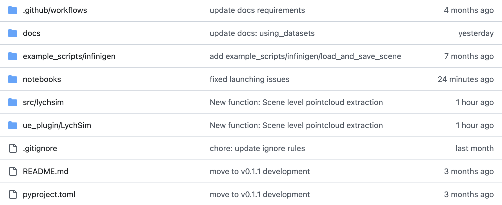
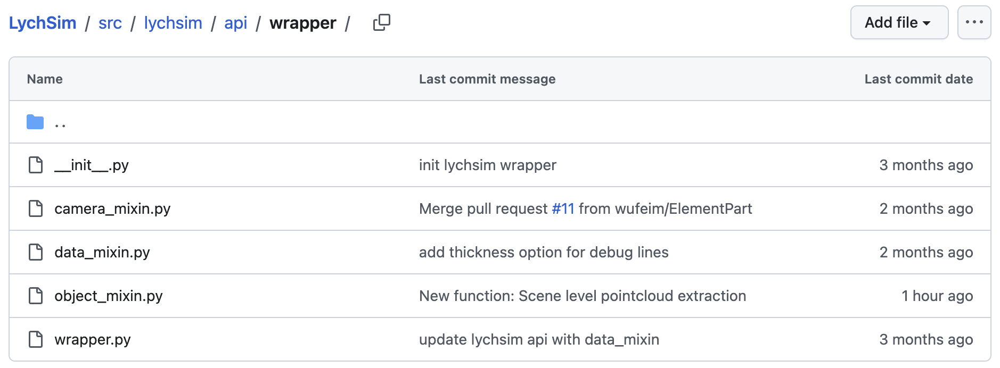
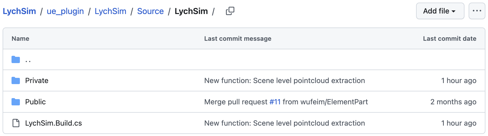

Development and Extensions
==========================

In this tutorial we will first review the

Basics
------

The structure of the LychSim codebase is shown below. The Python package :code:`lychsim` is located in :code:`src/lychsim`, while the Unreal Engine plugin written in C++ is located in :code:`ue_plugin/LychSim`. In addition, we provide example scripts in :code:`example_scripts` and demo notebooks in :code:`notebooks`.

   Codebase structure.

The Python package :code:`lychsim` implements helper functions to control the Unreal Engine simulation and data I/O. Notably some wrapper functions are implemented in :code:`src/lychsim/api/wrapper` to enable simpler controls.

   Python package.

The Unreal Engine plugin :code:`LychSim` is built on our previous `UnrealCV <https://unrealcv.org/>`_ plugin. From now on we will focus on explaining the code structure of this C++ plugin and how various functions are implemented.

   Unreal Engine plugin.

Command Parsing
---------------

LychSim enables Unix/POSIX-style command-line interface (CLI), *e.g.*,

.. code:: sh

   mycmd run -flag -arg=0

When executing a LychSim command, the command is first processed by the dispatcher function :code:`FCommandDispatcher::Exec` (`link <https://github.com/wufeim/LychSim/blob/main/ue_plugin/LychSim/Source/LychSim/Private/Server/CommandDispatcher.cpp#L196>`_). The raw command is parsed into positional, keyward, and flag arguments by :code:`LychSim::ParseTailWithFParse` (`link <https://github.com/wufeim/LychSim/blob/main/ue_plugin/LychSim/Source/LychSim/Private/Server/CommandDispatcher.cpp#L228>`_).

The parsed command is then executed by :code:`CmdUE->Execute` (`link <https://github.com/wufeim/LychSim/blob/main/ue_plugin/LychSim/Source/LychSim/Private/Server/CommandDispatcher.cpp#L235>`_), which corresponds to arguments of the handler function.

As an example, we update the location of an object in the Unreal Engine simulation. We first call the :code:`update_obj` function that takes the object ID, (optional) new location and (optional) new rotation as inputs (`link <https://github.com/wufeim/LychSim/blob/main/src/lychsim/api/wrapper/object_mixin.py#L40>`_). Note that the location and rotation are processed as keyword arguments and the object ID is regarded as a standard positional argument.

.. code:: python

   class ObjectCommandsMixin:
       def update_obj(self, obj_id, loc: list | np.ndarray = None, rot: list | np.ndarray = None) -> None:
           params = ""
           if loc is not None:
               loc = ",".join(map(str, loc))
               params += f" -loc={loc}"
           if rot is not None:
               rot = ",".join(map(str, rot))
               params += f" -rot={rot}"
           self.client.request(f"lych obj update {obj_id}{params}")

The command :code:`lych obj update car_01 -loc=0.5,0.2,0.0` will be parsed into positional arguments :code:`["car_01"]`, keyword arguments :code:`{"loc": "0.5,0.2,0.0"}`, and no additional flags.

Lastly the arguments are processed by the command handler :code:`FLychSimObjectHandler::UpdateObject` (`link <https://github.com/wufeim/LychSim/blob/main/ue_plugin/LychSim/Source/LychSim/Private/Commands/LychSimObjectHandler.cpp#L1316>`_)

.. code:: cpp

   FExecStatus FLychSimObjectHandler::UpdateObject(
	    const TArray<FString>& Pos,
       const TMap<FString,FString>& Kw,
       const TSet<FString>& Flags)
   {
       ...
   };

Note that the object location is always represented as a string during command parsing. The location will be parsed into a list of floats by the command handler itself (`link <https://github.com/wufeim/LychSim/blob/main/ue_plugin/LychSim/Source/LychSim/Private/Commands/LychSimObjectHandler.cpp#L1364>`_)

.. code:: cpp

   LocStr.ParseIntoArray(Parts, TEXT(","), true);

Example: Developing A New Command
---------------------------------

In this example we develop a new camera command step by step.  Suppose we want to implement a new camera command that returns a point map from the current view. We first define the function handler in :code:`ue_plugin/LychSim/Source/LychSim/Private/Commands/LychSimCameraHandler.h` and :code:`ue_plugin/LychSim/Source/LychSim/Private/Commands/LychSimCameraHandler.cpp`.

.. code:: cpp

   // ue_plugin/LychSim/Source/LychSim/Private/Commands/LychSimCameraHandler.h
   class FLychSimCameraHandler : public FCommandHandler
   {
   public:
       void RegisterCommands();
   private:
       FExecStatus GetPointMap(const TArray<FString>& Pos, const TMap<FString,FString>& Kw, const TSet<FString>& Flags);
   };

   // ue_plugin/LychSim/Source/LychSim/Private/Commands/LychSimCameraHandler.cpp
   FExecStatus FLychSimCameraHandler::GetPointMap(
	    const TArray<FString>& Pos,
	    const TMap<FString,FString>& Kw,
	    const TSet<FString>& Flags)
   {
       ...
   };

Then we register the new handlers as callable commands in :code:`ue_plugin/LychSim/Source/LychSim/Private/Commands/LychSimCameraHandler.cpp`.

.. code:: cpp

   void FLychSimCameraHandler::RegisterCommands() {
       CommandDispatcher->BindCommandUE(
           "lych cam get_pointmap",
           FDispatcherDelegateUE::CreateRaw(this, &FLychSimCameraHandler::GetPointMap),
           "Get point map in camera/world/OpenCV space"
       );
   }

Lastly we may implement helper Python functions in :code:`src/lychsim/api/wrapper/camera_mixin.py`.

.. code:: python

   class CameraCommandsMixin:
       def get_cam_pointmap(self, cam_id: int, space: str = "all") -> dict[str, np.ndarray]:
           ...
